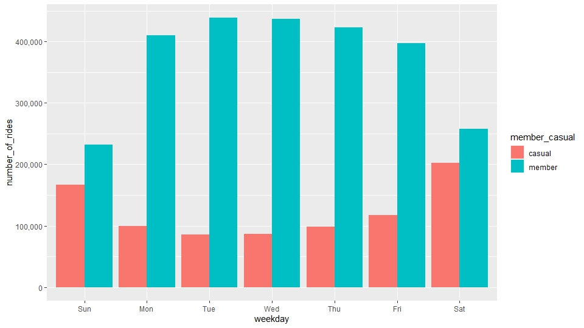
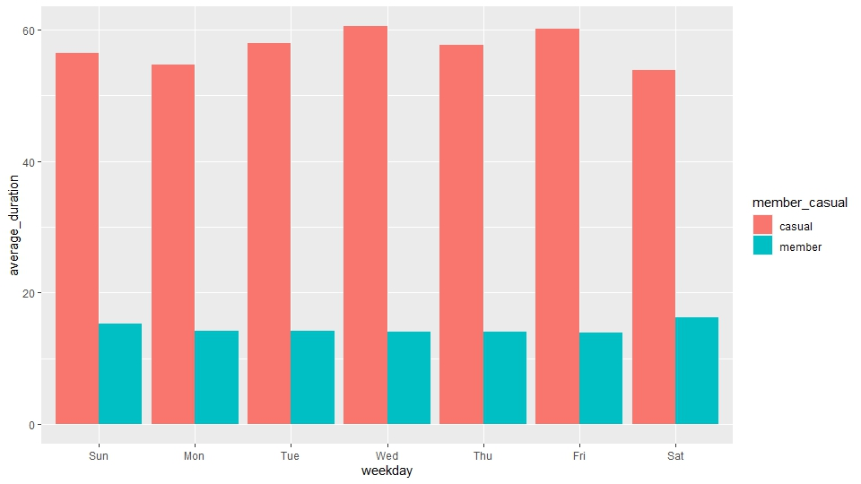

# cyclistic-data-analysis

## Trends in Cyclistic Bikes Usage

This is a Google Data Analytics Capstone project.This analysis focuses on identifying the trends in usage of Cyclistic Bike-Share (A fictional bike Sharing company) by Casual and Member Customer.

### Business Task:

  How do annual members and casual riders use Cyclistic bikes differently?

### Data Source

  The data used for this project is gotten from a third party data source, made available by Motivate International Inc. The public dataset contains data that can be used to explore different customer types that use Cyclistic bikes.

  The dataset consist of 4 tables, with contents relating to ride start and end locations, ride start and end time etc.  All data in each table were collected in the year 2019. The data has gone through the process of de-identification as users are represented with Id numbers and personal information was excluded. Each table holds data for every quarter of 2019 with the first quarter containing data from January to march 2019 etc.

### Data Cleaning

  Data was cleaned using the tidyverse package in Rstudio. Irrelevant data was removed and column names were renamed in tables to avoid irregularities when they were merged into a data frame.  Columns with date data types were formatted to the right date so as to ensure accurate results during analysis.

### Analysis

Tables were merged into one data frame. Calculations were performed to show average ride length in users and  total number of rides in users.

Results of the analysis revealed:

Average ride length for Casual Users:  56.88
Average ride length for Member Users:  14.38

 Further analysis was carried out to reveal the number of rides by different users for every weekday, and average ride length by different users for every weekday.
 
 
### Data Visualization

Graphs were plotted using the ggplot package in Rstudio.

1.  The bar graph below displays the number of rides for casual and member users for every weekday.

The graph indicates that member users had more number of rides with rides above 400,000 from Monday to Thursday. Casual members had less number of rides with rides at 200,000 on Saturday.

2. The bar graph below displays the average ride length for casual and member users for every day of the week.

The graph indicates that casual users had longer ride duration  with average rides as high as 60 mins on Wednesday. Member riders had shorter ride duration with the highest duration  on Sunday and Saturday just above 20 mins.

### Conclusion

  Member users make use of bikes more often than casual users.
  Member users have high number of rides on weekdays.
  Casual users ride the bikes for a longer period of time.
  Casual users have longer ride lengths on weekends

### Suggestions

  Bike ride packages should be created, with the aim of improving ride length in member users.
  Week day ride packages should also be created to encourage casual users to upgrade into member users.

### Further Exploration

More data should be collected on bike routes and dock stations to discover reasons for bike usage by different users. Also a follow up analysis would be required to determine reasons for weekend and weekday usage.
